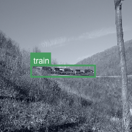
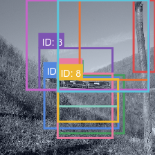
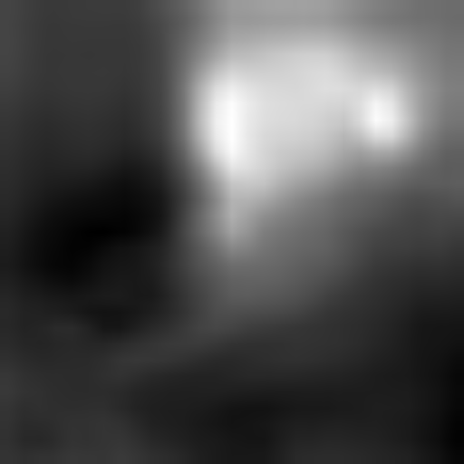
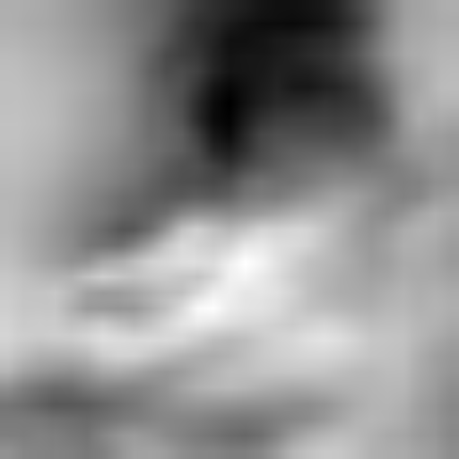
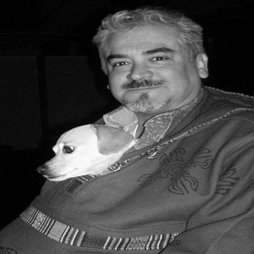
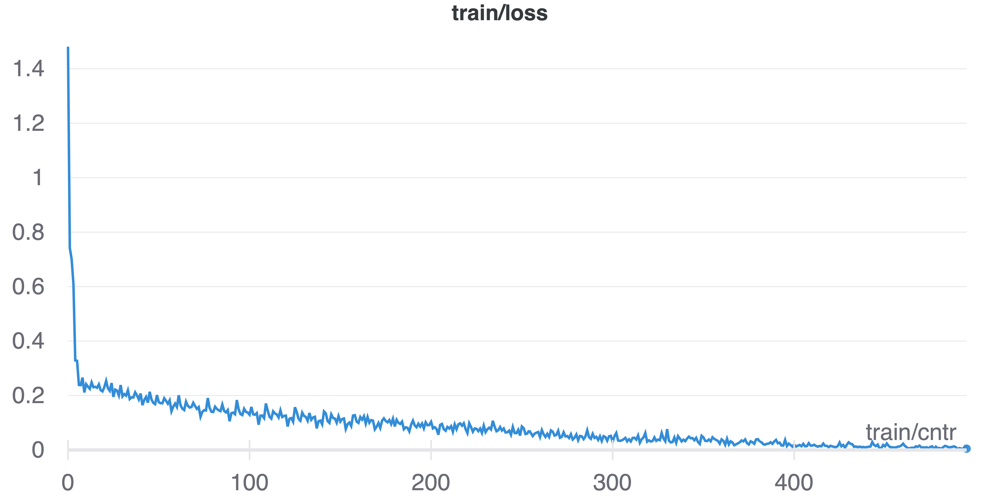
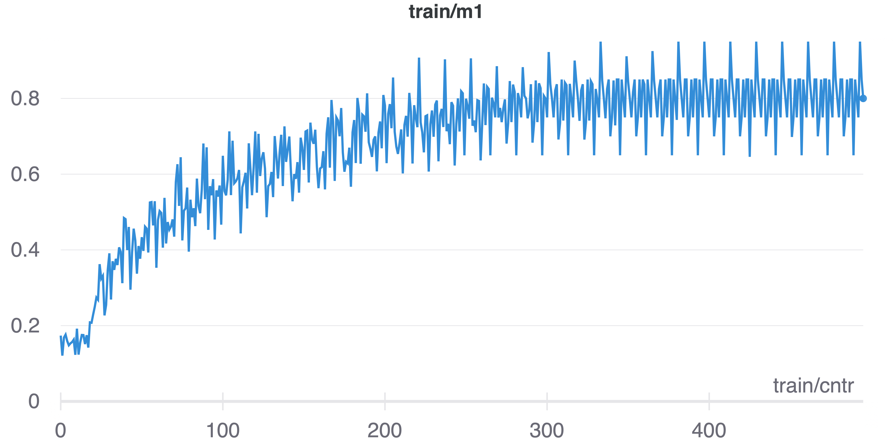

# Weakly Supervised Object Localization

This repository was created in partial fulfillment for the course [Visual Learning and Recognition (16-824) Fall 2021](https://visual-learning.cs.cmu.edu/), which I took at CMU. 

This repository contains code that trains object detectors in a *weakly supervised* setting, which means you're going to train object detectors without bounding box annotations.

We use [PyTorch](pytorch.org) to create our models and [Weights and Biases](https://wandb.ai/site) for visualizations and logging. We implemented a slightly simplified version of the following papers:

1. Oquab, Maxime, et al. "*Is object localization for free?-weakly-supervised learning with convolutional neural networks.*" Proceedings of the IEEE Conference on Computer Vision and Pattern Recognition. 2015. [Link](https://www.di.ens.fr/~josef/publications/Oquab15.pdf)
2. Bilen, Hakan, and Andrea Vedaldi. "*Weakly supervised deep detection networks*." Proceedings of the IEEE Conference on Computer Vision and Pattern Recognition. 2016. [Link](https://www.robots.ox.ac.uk/~vgg/publications/2016/Bilen16/bilen16.pdf)

We used the [PASCAL VOC 2007](http://host.robots.ox.ac.uk/pascal/VOC/voc2007/index.html) dataset for training, to be consistent with the results of [WSDDN](https://www.robots.ox.ac.uk/~vgg/publications/2016/Bilen16/bilen16.pdf). The Pascal VOC dataset comes with bounding box annotations, however, we do not use bounding box annotations as we are in the weakly supervised setting. 


## Software Setup

The following Python libraries are required for running the repository:

1. PyTorch
2. Weights and Biases
3. SKLearn
4. Pillow (PIL)
5. Weights and Biases (wandb)


### Data setup
To download the image dataset you can use the code below. The data below should be stored in the folder `data`.
```bash
$ cd data
$ wget http://host.robots.ox.ac.uk/pascal/VOC/voc2007/VOCtrainval_06-Nov-2007.tar
$ tar xf VOCtrainval_06-Nov-2007.tar
$ # Also download the test data
$ wget http://host.robots.ox.ac.uk/pascal/VOC/voc2007/VOCtest_06-Nov-2007.tar && tar xf VOCtest_06-Nov-2007.tar
$ cd VOCdevkit/VOC2007/
$ export DATA_DIR=$(pwd)
```
WSDDN [2] requires bounding box proposals from either Selective Search, Edge Boxes or any other similar method. We can download these proposals from the follwoing link. You need to put these proposals in the `data` folder too. The code below can be used to download these models.
	
```bash
# You can run these commands to populate the data directory
$ # First, cd to the main code folder
$ cd data/VOCdevkit/VOC2007/
$ # Download the selective search data
$ wget https://www.cs.cmu.edu/~spurushw/files/selective_search_data.tar && tar xf selective_search_data.tar
```


## Having a quick look at the data
Before diving into the code, we will have a quick look at the dataset and the bounding boxes. We can plot the images and their bounding boxes using wandb. To run your own visulaization, you can adapt the file `visualize_dataset.ipynb`. An example is shown below. The image on the left is a sample image and its ground truth bounding box, while the image on the right is the proposed bounding boxes from selective search. 

 

The final heatmaps can be visualized using weights and biases as shown below. We first plot the heatmaps for the normal Alexnet model, and then plot the heatmaps for the robust alexnet model, which learns weights at different scales in the image.

The image on the left is a picture of a man and his dog. We ideally should have two activations, one for the man and one for the dog. We plot the heatmaps that we get using the robust alexnet model for the person and dog filters below. Notics how the man activations focus on his head, while the dog activation focuses on the dog.

| - | - | - |
|---|---|---|
| I am text to the left  |  |  |
|  | I am text to the right | I am text to the right |


  


## Training the Weakly Supervised Convolutional Neural Networks
We can train our Weakly Supervised CNN using the code `WS_CNN.py`. We have two different models, which give us different degrees of heatmap expression.

```python
import wandb
wandb.init(project="vlr-hw2")
# logging the loss
wandb.log({'epoch': epoch, 'loss': loss})
```

We plot the training loss and multi-label classification error below, across epochs.

 


## Task 2: Weakly Supervised Deep Detection Networks

First, make sure you understand the WSDDN model. 

The main script for training is ``task_2.py``.  Read all the comments to understand what each part does. There are a few major components that you need to work on:

- The network architecture and functionality ``WSDDN``
- Writing the traning loop and including visualizations for metrics
- The function `test_net()` in `task_2.py`, which will log metrics on the test set

Tip for Task 2: conda install tmux, and train in a tmux session. That way you can detach, close your laptop (don't stop your ec2 instance!), and go enjoy a cookie while you wait.

#### Q2.1 In ``wsddn.py``, you need to complete the  ``__init__, forward`` and `` build_loss`` functions. 
The `__init__()` function will be used to define the model. You can define 3 parts for the model
1. The feature extractor
2. A ROI-pool layer (use torchvision.ops)
3. A classifier layer, as defined in the WSDDN paper.

The `forward()` function will essentially do the following:
1. Extract features from a given image (notice that batch size is 1 here).
2. Use the regions proposed from Selective Search, perform ROI Pooling. There are 2 caveats here - ensure that the proposals are now absolute values of pixels in the input image, and ensure that the scale factor passed into the ROI Pooling layer works correctly for the given image and features [ref](https://discuss.pytorch.org/t/spatial-scale-in-torchvision-ops-roi-pool/59270).
3. For each image, ROI Pooling gives us a feature map for the proposed regions. Pass these features into the classifier subnetwork. Here, you can think of batch size being the number of region proposals for each image.
4. Combine the classifier outputs (for boxes and classes), which will give you a tensor of shape (N_boxes x 20). Return this.

The `build_loss()` function now computes classification loss, which can be accessed in the training loop.


#### Q2.2 In ``task_2.py`` you will first need to write the training loop.
This involves creating the dataset, calling the dataloaders, etc. and then finally starting the training loop with the forward and backward passes. Some of this functionality has already been implemented for you. Ideally, use the hyperparameters given in the code. You don't need to implement the visualizations yet.
Use `top_n=300`, but feel free to increase it as well.

#### Q2.3 In ``task_2.py``, you now need to write a function to test your model, and visualize its predictions.
1. Write a test loop similar to the training loop, and calculate mAP as well as class-wise AP's.

At this point, we have our model giving us (N_boxes x 20) scores. We can interpret this as follows - for each of the 20 classes, there are `N` boxes, which have confidence scores for that particular class. Now, we need to perform Non-Max Suppression for the bbox scores corresponding to each class.
- In `utils.py`, write the NMS function. NMS depends on the calculation of Intersection Over Union (IoU), which you can either implement as a separate function, or vectorize within the NMS function itself. Use an IoU threshold of 0.3.
- Use NMS with a confidence threshold of 0.05 (basically consider only confidence above this value) to remove unimportant bounding boxes for each class.
- In the test code, iterate over indices for each class. For each class, visualize the NMSed bounding boxes with the class names and the confidence scores. You can use wandb for this, but if using ImageDraw or something else is more convenient, feel free to use that instead.


#### Q2.4 In ``task_2.py``, there are places for you perform visualization (search for TODO). You need to perform the appropriate visualizations mentioned here:
- Plot the loss every 500 iterations using wandb.
- Use wandb to plot mAP on the *test* set every epoch.
- Plot the class-wise APs at every epoch.
- Plot bounding boxes on 10 random images at the end of the first epoch, and at the end of the last epoch. (You can visualize for more images, and choose whichever ones you feel represent the learning of the network the best. It's also interesting to see the kind of mistakes the network makes as it is learning, and also after it has learned a little bit!)

#### Q2.5 Train the model using the hyperparameters provided for 5-6 epochs.
The expected values for the metrics at the end of training are:
- Train Loss: ~1.0
- Test  mAP : ~0.13

Include all the code and images/logs after training.
Report the final class-wise AP on the test set and the mAP.
