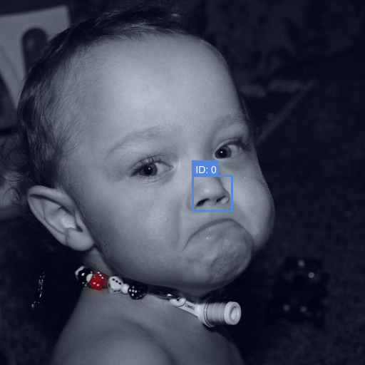

# Weakly Supervised Object Localization

This repository was created in partial fulfillment for the course [Visual Learning and Recognition (16-824) Fall 2021](https://visual-learning.cs.cmu.edu/), which I took at CMU. 

This repository contains code that trains object detectors in a *weakly supervised* setting, which means you're going to train object detectors without bounding box annotations.

We use [PyTorch](pytorch.org) to create our models and [Weights and Biases](https://wandb.ai/site) for visualizations and logging. We implemented a slightly simplified version of the following papers:

1. Oquab, Maxime, et al. "*Is object localization for free?-weakly-supervised learning with convolutional neural networks.*" Proceedings of the IEEE Conference on Computer Vision and Pattern Recognition. 2015. [Link](https://www.di.ens.fr/~josef/publications/Oquab15.pdf)
2. Bilen, Hakan, and Andrea Vedaldi. "*Weakly supervised deep detection networks*." Proceedings of the IEEE Conference on Computer Vision and Pattern Recognition. 2016. [Link](https://www.robots.ox.ac.uk/~vgg/publications/2016/Bilen16/bilen16.pdf)

We used the [PASCAL VOC 2007](http://host.robots.ox.ac.uk/pascal/VOC/voc2007/index.html) dataset for training, to be consistent with the results of [WSDDN](https://www.robots.ox.ac.uk/~vgg/publications/2016/Bilen16/bilen16.pdf). The Pascal VOC dataset comes with bounding box annotations, however, we do not use bounding box annotations as we are in the weakly supervised setting. 


## Software Setup

The following Python libraries are required for running the repository:

1. PyTorch
2. Weights and Biases
3. SKLearn
4. Pillow (PIL)
5. Weights and Biases (wandb)


### Data setup
To download the image dataset you can use the code below. The data below should be stored in the folder `data`.
```bash
$ cd data
$ wget http://host.robots.ox.ac.uk/pascal/VOC/voc2007/VOCtrainval_06-Nov-2007.tar
$ tar xf VOCtrainval_06-Nov-2007.tar
$ # Also download the test data
$ wget http://host.robots.ox.ac.uk/pascal/VOC/voc2007/VOCtest_06-Nov-2007.tar && tar xf VOCtest_06-Nov-2007.tar
$ cd VOCdevkit/VOC2007/
$ export DATA_DIR=$(pwd)
```
WSDDN [2] requires bounding box proposals from either Selective Search, Edge Boxes or any other similar method. We can download these proposals from the follwoing link. You need to put these proposals in the `data` folder too. The code below can be used to download these models.
	
```bash
# You can run these commands to populate the data directory
$ # First, cd to the main code folder
$ cd data/VOCdevkit/VOC2007/
$ # Download the selective search data
$ wget https://www.cs.cmu.edu/~spurushw/files/selective_search_data.tar && tar xf selective_search_data.tar
```


## Having a quick look at the data
Before diving into the code, we will have a quick look at the dataset and the bounding boxes. We can plot the images and their bounding boxes using wandb. To run your own visulaization, you can adapt the file `visualize_dataset.ipynb`. An example is shown below. The image on the left is a sample image and its ground truth bounding box, while the image on the right is the proposed bounding boxes from selective search. 
| Picture of a random image and bounding box | Proposed Bounding boxes using selective search |
|---|---|
|  |  | 

The final heatmaps can be visualized using weights and biases as shown below. We first plot the heatmaps for the normal Alexnet model, and then plot the heatmaps for the robust alexnet model, which learns weights at different scales in the image.


## Training the Weakly Supervised Convolutional Neural Networks
We can train our Weakly Supervised CNN using the code `WS_CNN.py`. We have two different models, which give us different degrees of heatmap expressions.

```python
import wandb
wandb.init(project="vlr-hw2")
# logging the loss
wandb.log({'epoch': epoch, 'loss': loss})
```

We plot the training loss and multi-label classification error below, across epochs.

 

The images in the first column show a random picture from the dataset. For this example, we ideally should have two activations, one for the man and one for the dog. We plot the heatmaps that we get using the both the robust AlexNet model and the normal AlexNet for the person and dog filters below. Notice how the man activations focus on his head, while the dog activation focuses on the dog. This can be considered as a good sanity check to confirm that our model is indeed working.

### Robust AlexNet Results (with multi-scale aggregation)

| Picture of a man and his dog | Heatmap activations for the person filter | Heatmap activations for the dog filter |
|---|---|---|
|  |  |  |


### Normal AlexNet Results (vanilla baseline)

| Picture of a man and his dog | Heatmap activations for the person filter | Heatmap activations for the dog filter |
|---|---|---|
|  |  |  |


## Task 2: Weakly Supervised Deep Detection Networks

We can train our Weakly Supervised Deep Detection Network using the code `WS_DDN.py`. We show the results below. You can run the code using the command below:

```bash
python WS_DDN.py
```

We plot the mean average precision below, across epochs.


We show some bounding box results below. Note that these models do not have access to the ground truth boxes. 

### Some Results

| Picture of a man and his dog | Heatmap activations for the person filter | Heatmap activations for the dog filter |
|---|---|---|
|  |  |  |
| Picture of a man and his dog | Heatmap activations for the person filter | Heatmap activations for the dog filter |
|---|---|---|
|  |  |  |
| Picture of a man and his dog | Heatmap activations for the person filter | Heatmap activations for the dog filter |
|---|---|---|
|  |  |  |


### A Failure Case

| Misinterpreted the nostrils as a cycle |
|---|
|  |
